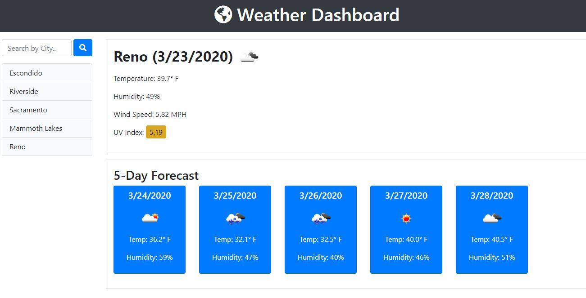

# Weather Dashboard

Weather Dashboard is an application that allows users to search by city name and view current and future weather conditions for that city.  The app runs in the browser and features dynamically updated HTML and CSS powered by jQuery.

Users are presented with current weather conditions including the tempuratue, humidity, wind speed, and UV index, as well as an icon representing the current weather.  They are also presented with a 5-day future forecast which includes temperatur, humidity, and an icon representation of that day's weather.  There is also a search history that contains all the cities the user has searched for, and the search history is persisted using local storage.

The weather data was obtained using a 3rd-party API called OpenWeatherMap.

## Links

* Deployed App: https://ryan-harris.github.io/weather-dashboard/

* Github Repo: https://github.com/ryan-harris/weather-dashboard

## Built With

* OpenWeatherMap API (https://openweathermap.org/)
* Moment.js (https://momentjs.com/)
* jQuery (https://jquery.com/)
* Bootstrap CSS Framework (https://getbootstrap.com/)

## Screenshot

